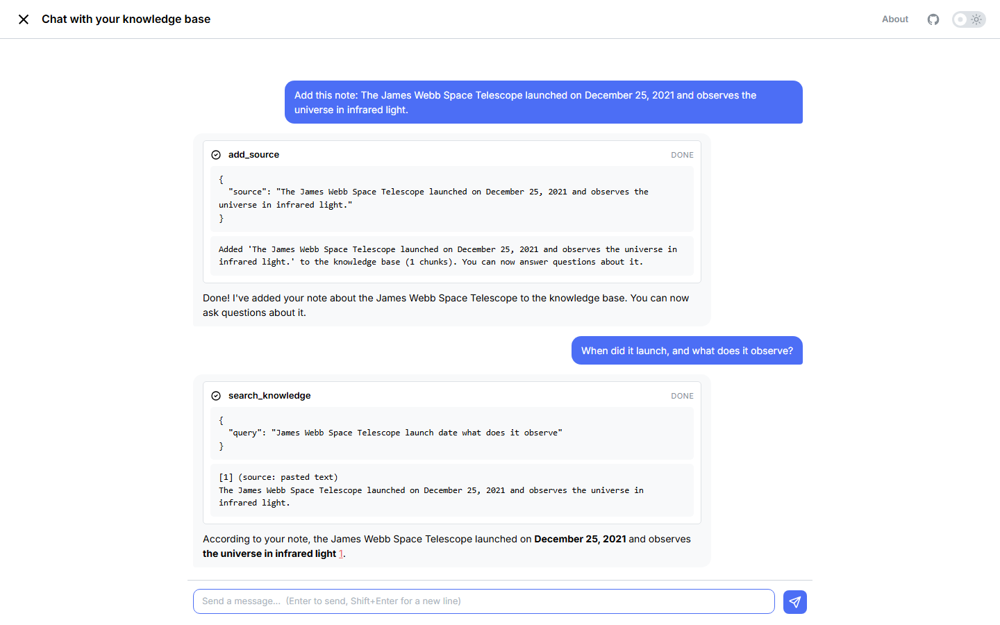

# Chat with your knowledge base

**A conversational RAG agent — LangGraph + OpenRouter, built on [Fast Dash](https://github.com/dkedar7/fast_dash)'s native chat mode.**



Share a **web page, PDF, YouTube video, or pasted text** by chatting, then ask questions — the agent ingests your sources, retrieves the relevant passages, and answers with inline citations. You watch it work: the "adding source" and "searching" steps show up as cards in the transcript.

> **A modern rebuild.** The original version was a form (paste your OpenAI key + URLs + a query) powered by Embedchain, which re-built the whole vector store on every query. This rewrite drops Embedchain and OpenAI entirely: it's a **LangGraph ReAct agent on OpenRouter** streamed through Fast Dash chat, with a per-session knowledge base and **local, key-free embeddings**.

## How it works

The entire app is one line — a compiled LangGraph graph handed to Fast Dash's chat mode:

```python
app = FastDash(callback_fn=build_graph(), chat=True, title="Chat with your knowledge base")
```

The agent has two tools:
- **`add_source`** — load a URL / YouTube link / PDF / text, chunk it, embed it locally (FastEmbed), and store it in this session's vector store.
- **`search_knowledge`** — semantic retrieval; the agent answers only from the retrieved passages and cites them `[1]`, `[2]`.

Fast Dash's langstage bridge streams the agent's tokens and tool calls into the chat, and gives it multi-turn memory. **OpenRouter** runs the LLM; retrieval embeddings are computed **locally** (no OpenAI, no embeddings API key).

## Run locally

```bash
uv sync
export OPENROUTER_API_KEY=...        # https://openrouter.ai/keys
uv run python -m app                 # http://127.0.0.1:8080
```

Optional: `KNOWLEDGE_CHAT_MODEL` (default `anthropic/claude-haiku-4.5`), `EMBED_MODEL` (default `BAAI/bge-small-en-v1.5`).

## Deploy

Served by gunicorn (gthread, single worker) so the chat history and per-session knowledge bases live in one process. The FastEmbed model is baked into the image at build time. See the `Dockerfile`. Set `OPENROUTER_API_KEY` as a secret on your host.

## Architecture

| File | Role |
| ---- | ---- |
| `app.py` | `FastDash(callback_fn=graph, chat=True)` — the whole app |
| `rag/graph.py` | The ReAct RAG agent on OpenRouter (system prompt + tools) |
| `rag/knowledge.py` | Per-session vector store, source loaders, chunking, retrieval |
| `rag/tools.py` | `add_source` / `search_knowledge` tools (session-scoped via config) |

## Stack

Fast Dash (chat mode) · LangGraph · LangChain (OpenRouter) · FastEmbed (local embeddings) · web / PDF / YouTube loaders.

## License

MIT — see [LICENSE](LICENSE).
